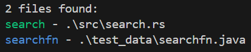

# fuzzy-ls

`fuzzy-ls` is a powerful command line utility that extends the functionality of the popular `ls` command by enabling fuzzy searching, regex pattern matching, exact matches, and more. It allows you to focus your search on specific file extensions or exclude certain extensions from the search space.

## Features

- **Fuzzy Searching**: Perform fuzzy searches to find files that approximately match your query.
- **Regex Pattern Matching**: Use regular expressions to search for files.
- **Exact Matches**: Search for files that exactly match your query.
- **Focus on Extensions**: Limit your search to specific file extensions.
- **Exclude Extensions**: Exclude files with certain extensions from your search.

## Usage

The help menu contains the necessary documentation on different options supported.

```
Fuzzy file search command line tool.

Usage: fuzzy-ls.exe [OPTIONS] <QUERY>


Options:
  -r, --regex                Query is a regex pattern and the search is performed using the regex.
  -p, --exact                Exact pattern matching is done for the query.
  -e, --exclude [<.ext>...]  Exclude files of specific extensions.
  -f, --focus [<.ext>...]    Focus search on specific set of extensions. In case both exclude and focus are provided, focus takes precedence.
  -h, --help                 Print help
  -V, --version              Print versionfuzzy-ls.exe [OPTIONS] <QUERY>
```
## Examples
Here are some examples demonstrating how to use `fuzzy-ls`. Exact matches are highlighted by green on terminal and fuzzy matches with blue like this:



### Fuzzy search
```shell
<cargo run>/<binary> search
search - .\src\search.rs
searchfn - .\test_data\searchfn.java
```

### Regex search
```shell
<cargo run>/<binary> fuzzy.* -r
fuzzy_ls - .\target\debug\deps\fuzzy_ls.d
fuzzy_ls - .\target\debug\deps\fuzzy_ls.exe
fuzzy_ls - .\target\debug\deps\fuzzy_ls.pdb
fuzzy-ls - .\target\debug\fuzzy-ls.d
fuzzy-ls - .\target\debug\fuzzy-ls.exe
fuzzy_ls - .\target\debug\fuzzy_ls.pdb
fuzzy_search - .\test_data\fuzzy_search.png
```

You can mix and match focused flags with any of the search type

#### Regex with focused extensions
```shell
<cargo run>/<binary> fuzzy.* -r -f exe
fuzzy_ls-2f8732b3ab03d5a6 - .\target\debug\deps\fuzzy_ls-2f8732b3ab03d5a6.exe
fuzzy_ls-c33a3a1ef73b944b - .\target\debug\deps\fuzzy_ls-c33a3a1ef73b944b.exe
fuzzy_ls - .\target\debug\deps\fuzzy_ls.exe
fuzzy-ls - .\target\debug\fuzzy-ls.exe
```

#### Regex with exclude extensions
```shell
<cargo run>/<binary> fuzzy.* -r -e exe
fuzzy_ls - .\target\debug\deps\fuzzy_ls.d
fuzzy_ls - .\target\debug\deps\fuzzy_ls.pdb
fuzzy-ls - .\target\debug\fuzzy-ls.d
fuzzy_ls - .\target\debug\fuzzy_ls.pdb
fuzzy_search - .\test_data\fuzzy_search.png
```

Note: In case both focused and exclude extensions are provided: focus extensions take a precedence.

### Exact string matching
```shell
<cargo run>/<binary> utils -p
utils - .\test_data\utils.cpp
utils - .\test_data\utils.h
```

## License
This project is licensed under the MIT License.