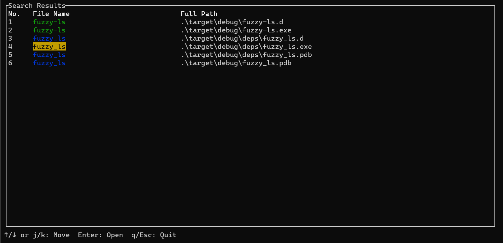

# fuzzy-ls
 

`fuzzy-ls` is a cross-platform command line utility that extends the functionality of the popular `ls` command along with a GUI by enabling fuzzy searching, regex pattern matching, exact matches, and more. It allows you to focus your search on specific file extensions or exclude certain extensions from the search space.

Here is an example of a search. Exact matches are highlighted by green on terminal and fuzzy matches with blue like this:




## Features

- **Fuzzy Searching**: Perform fuzzy searches to find files that approximately match your query.
- **Regex Pattern Matching**: Use regular expressions to search for files.
- **Exact Matches**: Search for files that exactly match your query.
- **Focus on Extensions**: Limit your search to specific file extensions.
- **Exclude Extensions**: Exclude files with certain extensions from your search.
- **GUI**: Get clear view of the search results in a terminal GUI and seamlessly navigate across your files.

## Fuzzy Searching Algorithm

Currently, the tool uses the [Damerau-Levenshtein](https://en.wikipedia.org/wiki/Damerau%E2%80%93Levenshtein_distance) algorithm for fuzzy searching. The Damerau-Levenshtein algorithm calculates the minimum number of operations (insertions, deletions, substitutions, and transpositions) required to transform one string into another.

## Usage

The help menu contains the necessary documentation on different options supported.

```
Fuzzy file search command line tool.

Usage: fuzzy-ls.exe [OPTIONS] <QUERY>


Options:
  -r, --regex                Query is a regex pattern and the search is performed using the regex.
  -p, --exact                Exact pattern matching is done for the query.
  -e, --exclude [<.ext>...]  Exclude files of specific extensions.
  -f, --focus [<.ext>...]    Focus search on specific set of extensions. In case both exclude and focus are provided, focus takes precedence.
  -h, --help                 Print help
  -V, --version              Print versionfuzzy-ls.exe [OPTIONS] <QUERY>
```
## Examples
### Fuzzy search
```shell
fuzzy-ls search
```

### Regex search
```shell
fuzzy-ls fuzzy.* -r
```


You can mix and match focused flags with any of the search type

#### Regex with focused extensions
```shell
fuzzy-ls fuzzy.* -r -f exe
```


#### Regex with exclude extensions
```shell
fuzzy-ls fuzzy.* -r -e exe
```

Note: In case both focused and exclude extensions are provided: focus extensions take a precedence.


### Exact string matching
```shell
fuzzy-ls utils -p
```


## Navigating to Files

Once you've found the files you're looking for, you can seamlessly navigate to them using your favorite code editors. The default editor is **Neovim (nvim)**, but you can easily configure it to use any editor of your choice.

### Default Editor (Neovim)
When you select a file in the fuzzy-ls interface, it will automatically open in Neovim by default:


### Using Other Editors
You can override the default editor used to open the file in `fuzzy-ls` using the `-d` flag.
```shell
fuzzy-ls search -d code
```


## Community Contribution
Feel free to contribute to the project whether its reporting issues/suggestions or feature requests or new feature PRs!

## License
This project is licensed under the MIT License.
